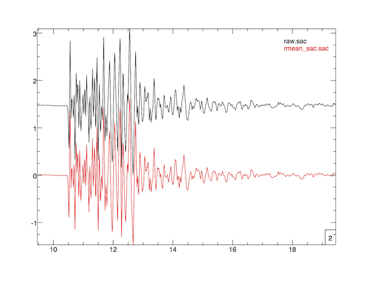

# Removing the Mean

Within SAC, removal of the mean is done by simply running
  
    SAC> rmean
  
within C or Fortran, the same code is called by

    remove_mean(y, n)            // in C
    call remove_mean(data, npts) ! in Fortran
   
The output of the  generates the following:

